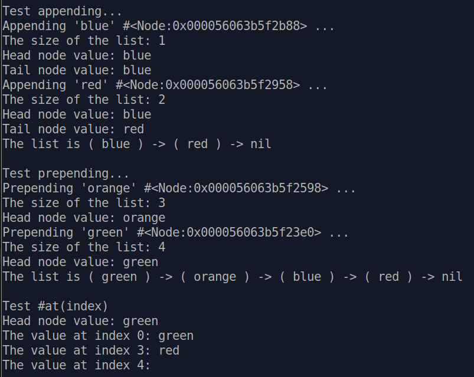
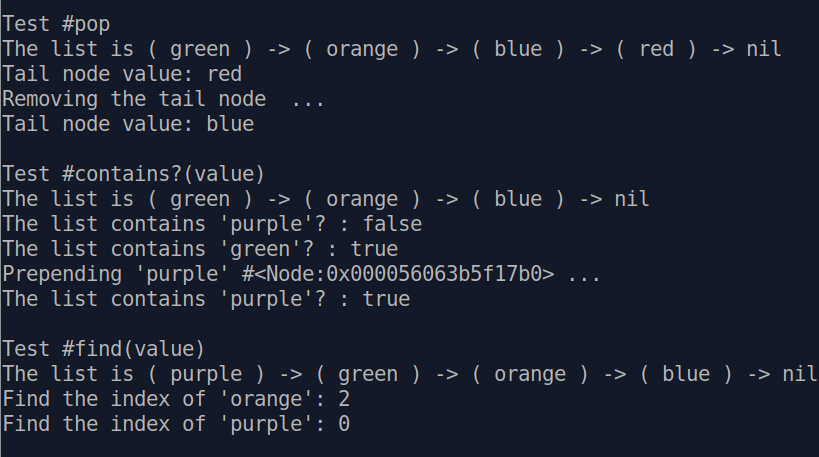
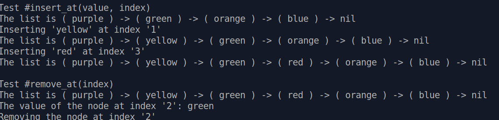

# Project: Data Structures and Algorithms

A basic linked list with various methods that operate on the list: 
- `append`
- `prepend`
- `size`
- `pop`
- `at(index)`
- `contains?(value)`
- `find(value)`
- `insert_at(index)`
- `remove_at(index)`

Demo output:

    
    
    

